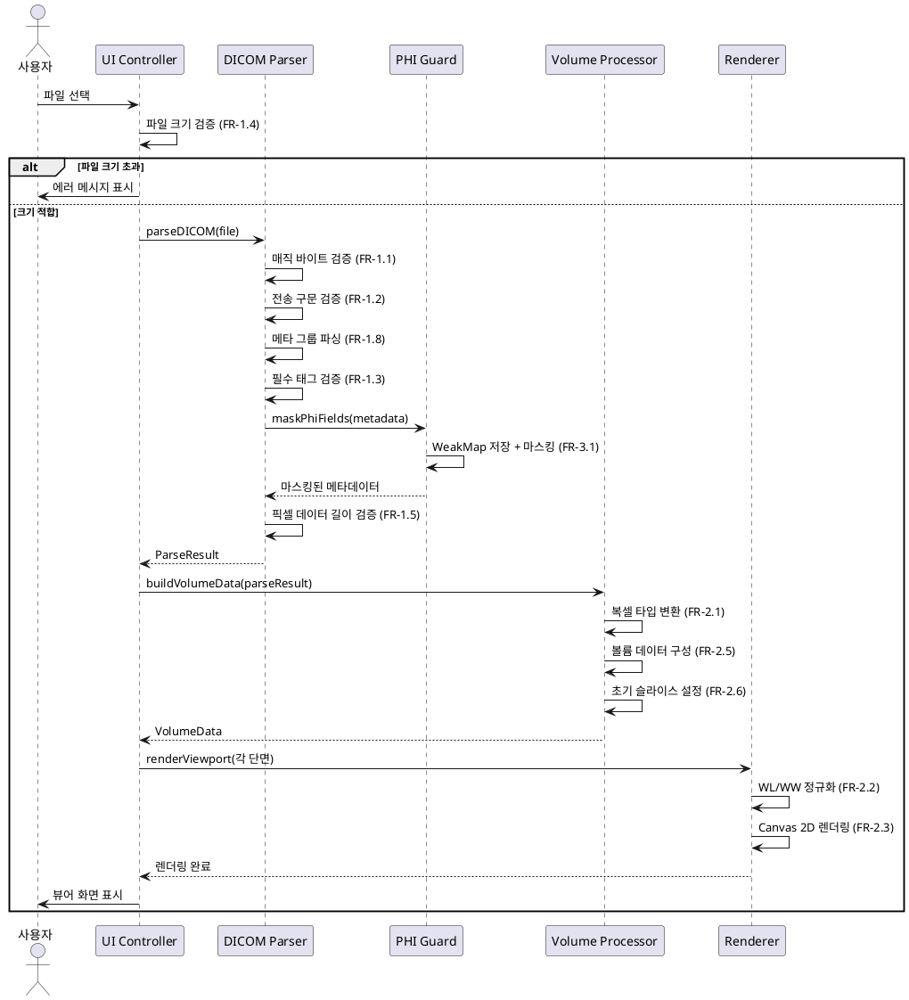
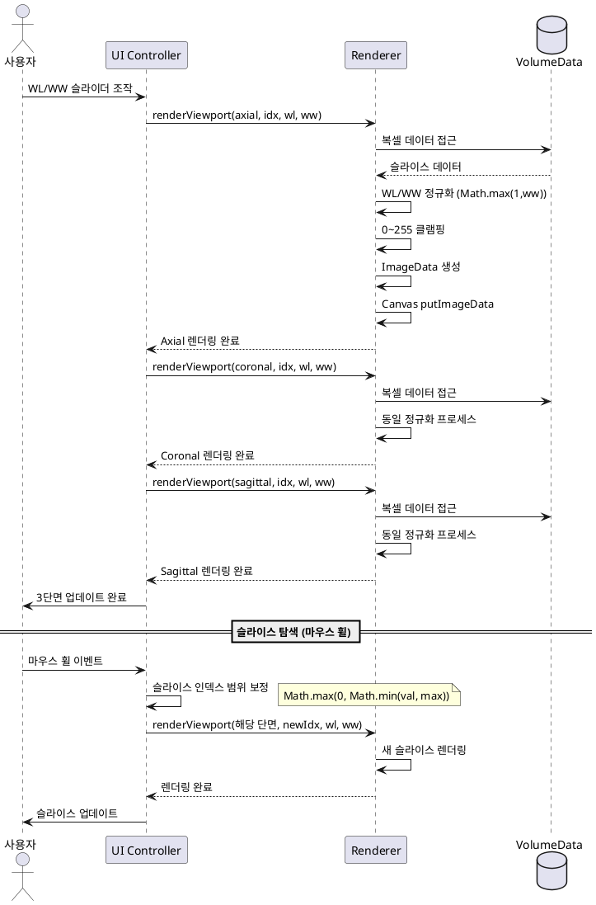
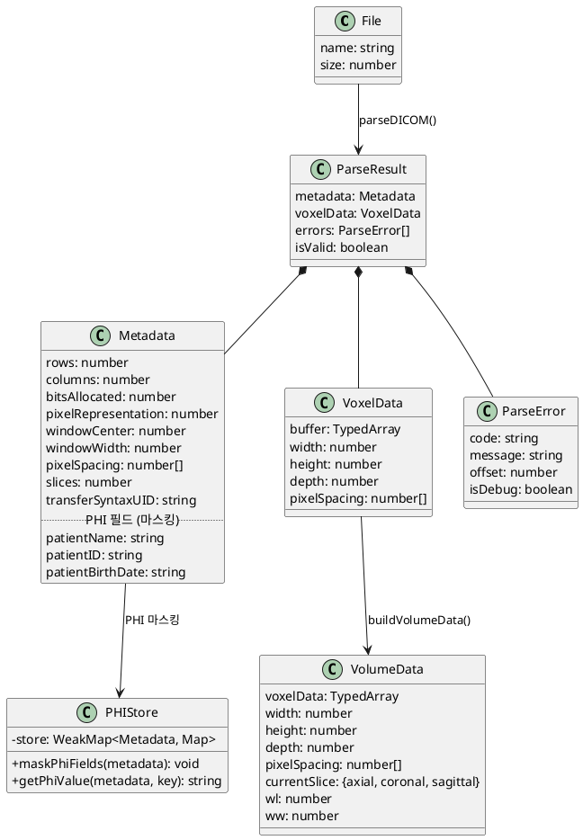

*소프트웨어 아키텍처 명세서 (Software Architecture Description)*

*프로젝트: DentiView3D - 웹 기반 CBCT 영상 뷰어*
*버전: 0.1.0 | 작성일: 2026-04-23*
*추적 티켓: PLAYG-1461*
*소프트웨어 안전 등급: IEC 62304 Class A*
*참조 문서: SRS(PLAYG-1460), RMR(PLAYG-1459)*

---

*[SAD-01] 아키텍처 개요 및 설계 원칙*

*아키텍처 개요*

DentiView3D는 브라우저 내에서 완전히 동작하는 클라이언트 사이드 웹 애플리케이션으로,
로컬 DICOM CBCT 파일을 파싱하여 3단면 MPR(Axial, Coronal, Sagittal) 영상을 렌더링한다.
본 아키텍처는 IEC 62304 Class A 기준을 충족하도록 Layered Architecture 패턴을 채택하며,
계층별 명확한 책임 분리를 통해 안전성, 유지보수성, 시험 가능성을 확보한다.

*핵심 설계 원칙*

- *단일 책임 원칙 (SRP)*: 각 컴포넌트는 하나의 명확한 책임을 가진다
- *관심사 분리 (SoC)*: 파싱, 변환, 렌더링, UI 관심사를 명확히 분리한다
- *정보 은폐 (Information Hiding)*: PHI 데이터는 WeakMap으로 캡슐화하여 외부 접근을 차단한다
- *방어적 프로그래밍 (Defensive Programming)*: 모든 외부 입력(DICOM 파일)은 신뢰할 수 없는 것으로 간주한다
- *단방향 의존성 (Unidirectional Dependency)*: 상위 계층은 하위 계층에만 의존한다

*아키텍처 스타일 및 선택 근거*

|| 항목 || 내용 ||
|| 스타일 || Layered Architecture (4계층) ||
|| 선택 근거 || 1) 클라이언트 사이드 단일 애플리케이션에 적합 2) Class A 수준의 명확한 모듈 경계 요구 3) SRS에 명시된 소스코드 모듈 분리와 자연스럽게 매핑 ||
|| 대안 검토 || Microservices(서버 불필요로 기각), Event-Driven(이벤트 소스 단일로 과설계), Pipe-Filter(조건부 분기 많아 부적합) ||

*참조 문서*

|| 문서 || 티켓 || 관계 ||
|| SRS || PLAYG-1460 || 요구사항 출처 ||
|| RMR || PLAYG-1459 || 위험 관리 근거 ||
|| SAD || PLAYG-1461 || 본 문서 ||
|| SDS || PLAYG-1462 || 상세 설계 (본 아키텍처 기반) ||
|| EA Gate || PLAYG-1458 || 상위 엔지니어링 분석 게이트 ||

---*[SAD-02] 논리적 뷰 (Logical View)*

*계층 구조*

본 시스템은 4개 계층으로 구성된다:

|| 계층 || 명칭 || 역할 ||
|| L1 || Presentation Layer || UI 렌더링, 사용자 이벤트 처리, 화면 전환 ||
|| L2 || Application Layer || 워크플로우 조율, 상태 관리, 컴포넌트 간 데이터 흐름 제어 ||
|| L3 || Domain Layer || DICOM 파싱, 볼륨 데이터 처리, PHI 보호, 영상 변환 ||
|| L4 || Infrastructure Layer || 상수 정의, 타입 정의, 브라우저 API 래퍼 ||

*컴포넌트 구성*

|| 컴포넌트 || 계층 || 역할 || 공개 인터페이스 ||
|| DICOM Parser || L3 || DICOM 파일 파싱, 메타데이터 추출, 픽셀 데이터 디코딩 || parseDICOM(file: File): ParseResult ||
|| Volume Processor || L3 || 복셀 데이터 변환, 볼륨 데이터 구성, WL/WW 정규화 || buildVolumeData(metadata, pixelData): VolumeData ||
|| PHI Guard || L3 || 환자 식별 정보 마스킹, 원본 접근 제어, 메모리 관리 || maskPhiFields(metadata): MaskedMetadata ||
|| Renderer || L2 || 3단면 MPR 렌더링, Canvas 2D 출력, WL/WW 실시간 갱신 || renderViewport(canvas, slice, wl, ww): void ||
|| UI Controller || L1 || 사용자 입력 처리, 화면 전환, 상태 표시 || handleFileSelect(event): void ||
|| Constants & Types || L4 || 상수 정의(MAX_FILE_SIZE, MAX_TAG_COUNT 등), 타입 정의(ParseResult 등) || (모듈 상수/타입 export) ||

*컴포넌트 간 인터페이스 정의*

|| 인터페이스 || 제공 컴포넌트 || 소비 컴포넌트 || 데이터 흐름 ||
|| parseDICOM(file) || DICOM Parser || UI Controller || File -> ParseResult ||
|| buildVolumeData(meta, pixel) || Volume Processor || UI Controller || ParseResult -> VolumeData ||
|| maskPhiFields(metadata) || PHI Guard || DICOM Parser || Metadata -> MaskedMetadata ||
|| renderViewport(canvas, ...) || Renderer || UI Controller || VolumeData + WL/WW -> Canvas ||
|| showStatus(msg) || UI Controller || (내부) || 문자열 -> DOM 업데이트 ||

*논리적 뷰 다이어그램 (Component Diagram)*

```plantuml
@startuml SAD_LogicalView
skinparam componentStyle rectangle
skinparam backgroundColor white

package "L1: Presentation Layer" as L1 {
    [UI Controller] as UI {
        파일 열기 / 슬라이더 / 상태 표시
    }
}

package "L2: Application Layer" as L2 {
    [Renderer] as REN {
        3단면 MPR Canvas 렌더링
    }
}

package "L3: Domain Layer" as L3 {
    [DICOM Parser] as DP {
        DICOM 파일 파싱
        메타데이터 추출
        픽셀 데이터 디코딩
    }
    [Volume Processor] as VP {
        복셀 데이터 변환
        WL/WW 정규화
        볼륨 데이터 구성
    }
    [PHI Guard] as PG {
        PHI 마스킹
        원본 접근 제어
    }
}

package "L4: Infrastructure Layer" as L4 {
    [Constants & Types] as CT {
        MAX_FILE_SIZE, MAX_TAG_COUNT
        ParseResult, VolumeData
    }
}

UI ..> DP : parseDICOM(file)
UI ..> VP : buildVolumeData()
UI ..> REN : renderViewport()
DP ..> PG : maskPhiFields()
DP ..> CT : 상수/타입 참조
VP ..> CT : 상수/타입 참조
REN ..> CT : 상수/타입 참조

@enduml
```

---*[SAD-03] 프로세스 뷰 (Process View)*

*동시성 모델*

DentiView3D는 단일 스레드 브라우저 환경에서 동작하며,
FileReader의 비동기 콜백과 이벤트 리스너를 통해 비동기 처리를 수행한다.
Web Worker는 사용하지 않으며, 메인 스레드에서 순차적으로 파싱과 렌더링을 처리한다.

*주요 프로세스 흐름 1: DICOM 파일 로딩 및 렌더링*



*주요 프로세스 흐름 2: WL/WW 조절 및 슬라이스 탐색*



*예외 흐름 처리*

|| 예외 상황 || 처리 방식 || 관련 FR ||
|| 매직 바이트 불일치 || 즉시 에러 메시지 표시 후 초기 상태 복귀 || FR-1.1, FR-5.4 ||
|| 미지원 전송 구문 || 에러 메시지 표시 후 초기 상태 복귀 || FR-1.2, FR-5.4 ||
|| 필수 태그 누락 || 에러 발생 후 초기 상태 복귀 || FR-1.3, FR-5.4 ||
|| 파일 크기 초과 || 메모리 로딩 없이 즉시 에러 표시 || FR-1.4 ||
|| 픽셀 데이터 불일치 || 경고 메시지 표시, Math.min으로 보정 후 계속 진행 || FR-1.5 ||
|| 태그 파싱 한계 초과 || MAX_TAG_COUNT 도달 시 안전 종료 || FR-5.1 ||
|| 버퍼 범위 초과 || hasRemaining() 검증으로 방지 || FR-5.3 ||

---*[SAD-04] 배포 뷰 (Deployment View)*

*물리적 배포 구성*

DentiView3D는 서버 없이 정적 파일로 배포되는 순수 클라이언트 사이드 애플리케이션이다.
Vite 번들러를 통해 HTML, CSS, JavaScript가 단일 번들로 빌드되어 브라우저에서 직접 실행된다.

|| 노드 || 유형 || 구성 요소 ||
|| 개발 환경 || 개발자 워크스테이션 || Node.js, Vite dev server, 소스코드 ||
|| 빌드 산출물 || 정적 파일 || index.html, bundle.js, assets/ ||
|| 실행 환경 || 클라이언트 브라우저 || Chrome 90+, HTML5 Canvas 2D API ||

*배포 다이어그램*

```plantuml
@startuml SAD_DeploymentView
skinparam backgroundColor white

node "개발 환경" as Dev {
    artifact "소스코드" as Src {
        src/
        dicomParser/
        types/
        constants.js
        main.js
    }
    component "Vite" as Vite {
        번들러 / 개발 서버
    }
}

node "빌드 산출물" as Build {
    artifact "정적 파일" as Dist {
        index.html
        bundle.js
        style.css
    }
}

node "실행 환경" as Runtime {
    component "Chrome 90+" as Browser {
        [UI Controller]
        [Renderer]
        [DICOM Parser]
        [Volume Processor]
        [PHI Guard]
    }
    storage "로컬 파일 시스템" as FS {
        DICOM 파일 (.dcm)
    }
}

Dev -right-> Build : npm run build
Build -right-> Runtime : 정적 파일 로드
Browser ..> FS : File API (읽기 전용)

note right of Runtime
    *네트워크 통신 없음*
    *모든 데이터 처리는 로컬에서만*
    *NFR-2.1: 오프라인 전용 동작*
end note

@enduml
```

*네트워크 토폴로지*

- 네트워크 통신 없음 (완전 오프라인)
- 모든 데이터 처리는 클라이언트 로컬 메모리에서 수행
- 파일 접근은 브라우저 File API를 통한 읽기 전용
- NFR-2.1(오프라인 전용 동작) 준수

---*[SAD-05] 데이터 뷰 (Data View)*

*데이터 아키텍처*

DentiView3D는 서버 없는 클라이언트 사이드 애플리케이션으로, 모든 데이터는 브라우저 메모리에 존재한다.
영구 저장소가 없으며, 세션 종료 시 모든 데이터가 해제된다.

*주요 데이터 모델*

|| 데이터 객체 || 역할 || 생명주기 || 관련 컴포넌트 ||
|| ArrayBuffer || 원본 DICOM 파일 바이트 || 파일 로딩 중 ~ 파싱 완료 후 해제 || DICOM Parser ||
|| ParseResult || 파싱 결과 표준 객체 || 파싱 완료 후 ~ 볼륨 데이터 구성 후 || DICOM Parser, UI Controller ||
|| Metadata || DICOM 메타데이터 (태그/값 쌍) || 파일 로딩 후 ~ 세션 종료 || DICOM Parser, PHI Guard, UI Controller ||
|| VolumeData || 3차원 복셀 데이터 + WL/WW || 파일 로딩 후 ~ 세션 종료 || Volume Processor, Renderer ||
|| PHI Store || WeakMap 기반 PHI 원본 값 || 메타데이터와 동일 생명주기 (GC) || PHI Guard ||

*데이터 흐름*

File -> ArrayBuffer -> ParseResult -> VolumeData -> Canvas ImageData
                         |
                         +-> Metadata -> PHI Guard (WeakMap)

*데이터 모델 다이어그램 (Class Diagram)*



*데이터 보안*

- PHI 원본 데이터는 WeakMap에 저장되어 외부 직접 접근 불가 (FR-3.1, FR-3.2)
- WeakMap 사용으로 메타데이터 객체 GC 시 PHI 원본도 자동 해제 (FR-3.3)
- dumpPhiValues() 함수는 배럴 파일(index.js)에서 노출하지 않음 (FR-3.2)
- 프로덕션 모드에서는 파싱 오류에 내부 오프셋/태그 정보 미포함 (NFR-2.3)

---*[SAD-06] 기술 스택 및 구성 요소*

|| 범주 || 기술 || 버전 || 선택 근거 ||
|| 프로그래밍 언어 || JavaScript (ES2020+) || ES2020 || SRS에 명시된 런타임 요구사항, Chrome 90+ 호환 ||
|| 모듈 시스템 || ES Modules || ES2020 || 네이티브 브라우저 지원, 트리 쉐이킹 가능 ||
|| 빌드 도구 || Vite || 최신 안정版 || SRS에 명시된 번들러, 빠른 HMR 및 최적화된 프로덕션 빌드 ||
|| 렌더링 API || HTML5 Canvas 2D || - || SRS에 명시된 렌더링 방식, WebGL 불필요 ||
|| 파일 I/O || FileReader API || - || 브라우저 네이티브 API, 로컬 파일 읽기 ||
|| 타입 시스템 || JSDoc (선택적) || - || TypeScript 오버헤드 없이 타입 힌트 제공 ||
|| 테스트 프레임워크 || Vitest || 최신 안정版 || Vite 생태계 통합, 빠른 테스트 실행 ||

*미들웨어/인프라*

- 서버 없음: 정적 파일 서빙만으로 동작
- 데이터베이스 없음: 모든 데이터는 메모리 상주
- 네트워크 통신 없음: NFR-2.1 준수
- 런타임 종속성 없음: 순수 JavaScript + 브라우저 API만 사용

*기술 선택 근거*

- *JavaScript (ES2020+)*: SRS 운영 환경에 명시, 브라우저 네이티브 실행, 의존성 최소화
- *Canvas 2D API*: MPR 영상 렌더링에 충분한 성능, WebGL의 복잡도 불필요
- *Vite*: SRS에 명시된 번들러, 빠른 개발 피드백, 최적화된 프로덕션 빌드
- *FileReader API*: 브라우저 네이티크 로컬 파일 읽기, 별도 라이브러리 불필요

---*[SAD-07] 아키텍처 결정 근거 (ADR) 요약*

본 절에서는 아키텍처 수준의 주요 결정사항을 요약한다. 상세 내용은 개별 ADR 티켓을 참조한다.

|| ADR ID || 결정 사항 || 근거 || 관련 컴포넌트 || 관련 FR/NFR ||
|| ADR-1 || Layered Architecture 채택 || 클라이언트 단일 앱 적합, Class A 모듈 분리 요구 충족 || 전체 || NFR-5.1, NFR-5.2 ||
|| ADR-2 || 순수 Canvas 2D 렌더링 || MPR 2D 슬라이스에 충분, WebGL 복잡도 불필요 || Renderer || FR-2.2, FR-2.3, NFR-1.2 ||
|| ADR-3 || WeakMap 기반 PHI 보호 || 정보 은폐 원칙, GC 연동 메모리 관리 || PHI Guard || FR-3.1, FR-3.2, FR-3.3, NFR-2.2 ||
|| ADR-4 || 사전 검증 파이프라인 || 방어적 프로그래밍, 메모리 로딩 전 입력 검증 || DICOM Parser || FR-1.1~FR-1.6, NFR-3.2 ||
|| ADR-5 || 오프라인 전용 아키텍처 || 민감 데이터 네트워크 전송 원천 차단 || 전체 || NFR-2.1, FR-3군 ||

*ADR-1: Layered Architecture 채택*
- 문제: 시스템 복잡도 관리와 IEC 62304 Class A 모듈 분리 요구
- 대안: Microservices(서버 불필요), Event-Driven(과설계), Pipe-Filter(조건부 분기 다수)
- 결정: 4계층 Layered Architecture (Presentation, Application, Domain, Infrastructure)
- 근거: SRS 소스코드 모듈 분리와 자연스러운 매핑, 단방향 의존성 보장

*ADR-2: 순수 Canvas 2D 렌더링*
- 문제: MPR 영상 렌더링을 위한 그래픽스 기술 선택
- 대안: WebGL(과도한 복잡도), SVG(대용량 데이터 부적합)
- 결정: HTML5 Canvas 2D API
- 근거: SRS IF-2.2 명시, 2D 슬라이스 렌더링에 충분한 성능(NFR-1.2: 100ms 이내)

*ADR-3: WeakMap 기반 PHI 보호*
- 문제: 환자 식별 정보의 안전한 메모리 관리
- 대안: closure(참조 유지 가능), Symbol(완전 은폐 어려움)
- 결정: WeakMap<Metadata, Map<string, string>> 구조
- 근거: FR-3.1 마스킹, FR-3.2 접근 제어, FR-3.3 GC 연동 자동 해제

*ADR-4: 사전 검증 파이프라인*
- 문제: 악의적/손상된 DICOM 파일로부터 시스템 보호
- 대안: 파싱 중 검증(오류 복구 복잡), 사후 검증(메모리 낭비)
- 결정: 파일 크기 -> 매직 바이트 -> 전송 구문 -> 필수 태그 순차 사전 검증
- 근거: NFR-3.2(입력 검증 완전성), RMR HAZ-1군 위험 완화

*ADR-5: 오프라인 전용 아키텍처*
- 문제: 의료 영상 데이터의 네트워크 전송으로 인한 정보 유출 위험
- 대안: 서버 기반 처리(보안 위험 증가), 하이브리드(복잡도 증가)
- 결정: 완전 오프라인, 네트워크 통신 없는 순수 클라이언트 아키텍처
- 근거: NFR-2.1(오프라인 전용), RMR HAZ-3군(PHI 유출 방지), 제품 정의 부합

---*[SAD-08] 품질 속성 (Quality Attributes)*

*보안 (Security)*

- *인증/권한 부여*: 해당 없음 (오프라인 단일 사용자 애플리케이션)
- *데이터 보호*: PHI 원본은 WeakMap으로 캡슐화, 마스킹된 메타데이터만 외부 노출 (FR-3.1, FR-3.2)
- *네트워크 보안*: 모든 네트워크 통신 차단, 민감 데이터 로컬 외부 유출 원천 방지 (NFR-2.1)
- *감사 로그*: 해당 없음 (Class A 수준에서 감사 로그 미요구)
- *디버그 정보 보호*: 프로덕션에서 내부 파싱 정보(offset, tag) 미노출 (NFR-2.3)

*성능 (Performance)*

|| 품질 속성 || 목표 || 측정 방법 || 관련 FR ||
|| 파일 로딩 응답 || 100MB 이하 파일 5초 이내 || 성능 테스트 || NFR-1.1 ||
|| WL/WW 반응 || 100ms 이내 재렌더링 || 이벤트-렌더 지연 측정 || NFR-1.2 ||
|| 슬라이스 전환 || 50ms 이내 렌더링 || 휠-렌더 지연 측정 || NFR-1.3 ||
|| 메모리 사용 || 파일 크기의 2배 이하 || Chrome DevTools 힙 프로파일 || NFR-3.3 ||

*가용성 (Availability)*

- *장애 복구*: 파싱 실패 시 애플리케이션 중단 없이 초기 상태로 복귀 (NFR-3.1)
- *이중화*: 해당 없음 (단일 클라이언트 애플리케이션)
- *오류 처리*: 모든 오류를 사용자 친화적 메시지로 변환 (FR-5.4)

*유지보수성 (Maintainability)*

- *모듈화*: 4계층 6개 컴포넌트로 명확히 분리
- *테스트 가능성*: 각 컴포넌트는 독립 단위 테스트 가능 (parseDICOM, buildVolumeData, renderViewport 등)
- *추적성*: FR/NFR -> 컴포넌트 -> 소스코드 모듈 양방향 추적 (NFR-5.1, NFR-5.2)

*안전성 (Safety)*

- *안전 등급*: IEC 62304 Class A
- *위험 완화*: RMR(PLAYG-1459)에서 식별된 17개 Hazard에 대한 아키텍처 수단 적용
- *입력 검증*: 사전 검증 파이프라인으로 무효 데이터 처리 방지 (FR-1.1~FR-1.6)
- *메모리 안전*: 파일 크기 제한 + 버퍼 범위 검증 (FR-1.4, FR-5.3)
- *무한 루프 방지*: MAX_TAG_COUNT, MAX_SEQUENCE_DEPTH 제한 (FR-5.1, FR-5.2)
- *사용자 경고*: 진단 목적 아님 명시 (FR-4.6)

---*[SAD-09] 제약 조건 (Constraints)*

*규제 제약*

|| 제약 || 근거 || 영향 ||
|| IEC 62304 Class A || 소프트웨어 안전 등급 분류 || 단위 테스트, 소스코드 추적성 요구 ||
|| ISO 14971:2019 || 위험 관리 || RMR(PLAYG-1459) Hazard 완화 설계 반영 ||
|| DICOM PS3.5~3.10 || 파일 포맷 표준 || 전송 구문, 메타데이터 파싱 준수 ||
|| FDA 21 CFR Part 11 || 해당 사항 없음 || 전자 기록/서명 기능 미포함 ||

*하드웨어 제약*

- *대상 플랫폼*: Chrome 90+ 브라우저가 실행 가능한 PC/태블릿
- *메모리*: 클라이언트 브라우저 사용 가능 메모리에 종속 (최대 파일 512MB)
- *GPU*: 요구하지 않음 (Canvas 2D API 사용)
- *네트워크*: 불필요 (완전 오프라인)

*소프트웨어 제약*

- *운영체제*: Chrome 90+ 지원 OS (Windows, macOS, Linux)
- *브라우저*: Chrome 90+ 필수 (HTML5 Canvas 2D, FileReader API)
- *JavaScript*: ES2020+ (BigInt, globalThis, optional chaining 등)
- *외부 라이브러리*: 최소화 (런타임 종속성 없음)
- *번들러*: Vite (빌드 타임에만 사용)

*조직/프로세스 제약*

- *개발 방법론*: IEC 62304 생명주기 프로세스 준수
- *문서화*: SRS, SAD, SDS, RMR 문서 체계 유지
- *추적성*: 요구사항-아키텍처-소스코드 양방향 추적성 필수
- *버전 관리*: Git 기반 소스코드 버전 관리
- *테스트*: IEC 62304 Class A 수준 단위 테스트 필수

---

*작성 정보*
- 작성자: AI 소프트웨어 아키텍처 설계 에이전트
- 검토자: (프로젝트 관리자 검토 필요)
- 승인일: (검토 후 기입)
- 문서 ID: PLAYG-1461